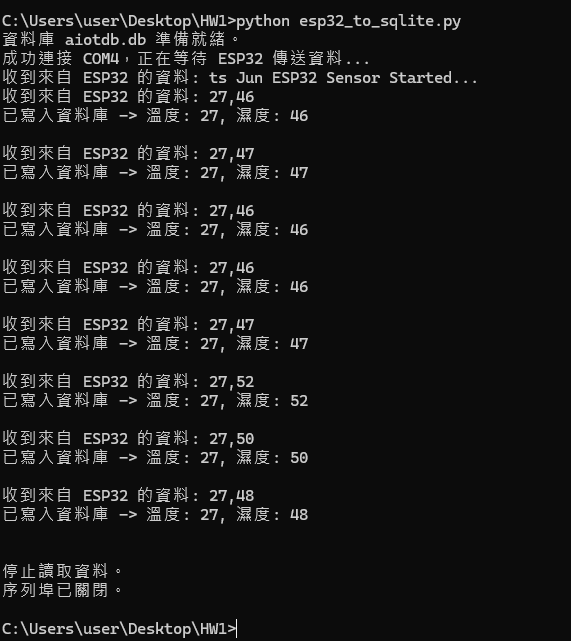
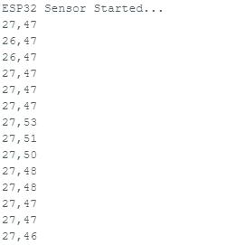
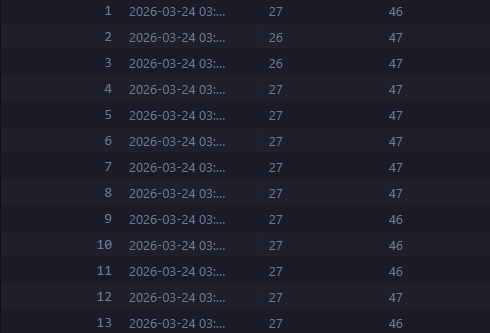

# HW1-ESP32-IoT-System

This project is an IoT (Internet of Things) system that reads temperature and humidity data using a DHT11 sensor connected to an ESP32 microcontroller. The ESP32 sends the collected data over a Serial port to a computer, where a Python script receives the data and stores it in a SQLite database.

## Features

- **ESP32 Data Collection**: Uses a DHT11 sensor to read temperature and humidity.
- **Serial Communication**: ESP32 sends the data in a `temperature,humidity` format via USB Serial.
- **Python Data Server**: A Python script (`esp32_to_sqlite.py`) listens to the serial port, parses the real-time data, and automatically saves it into a local SQLite database (`aiotdb.db`).
- **SQLite Database**: Stores the history of temperature and humidity readings along with a timestamp for future analysis.

## Project Architecture

```plaintext
HW1/
├── ESP32_DHT11_Python/
│   └── ESP32_DHT11_Python.ino  # ESP32 firmware for reading DHT11 sensor data
├── README.md                   # Project documentation
├── aiotdb.db                   # SQLite database storing sensor readings
├── esp32_to_sqlite.py          # Python script to receive data via Serial and store in DB
├── result1.png                 # System execution screenshot 1
├── result2.png                 # System execution screenshot 2
└── result3.png                 # System execution screenshot 3
```


## Hardware Requirements

- **ESP32 Development Board**
- **DHT11 Temperature & Humidity Sensor**
- Jumper wires and USB cable

## Software Requirements

- Arduino IDE (with ESP32 board support and `SimpleDHT` library installed)
- Python 3.x
- `pyserial` library (`pip install pyserial`)
- SQLite3 (built-in Python module)

## How to Run

1. **Upload ESP32 Code**: Open `ESP32_DHT11_Python/ESP32_DHT11_Python.ino` in Arduino IDE, select your ESP32 board and COM port, and upload the code.
2. **Configure Python Script**: Open `esp32_to_sqlite.py` and ensure the `SERIAL_PORT` variable matches your ESP32's COM port (e.g., `COM4`).
3. **Execute Python Script**:
   ```bash
   python esp32_to_sqlite.py
   ```
4. **View Database**: Use a SQLite viewer (like DBeaver or DB Browser for SQLite) to access `aiotdb.db` and view the logged sensor data.

## Results Screenshots

Below are the screenshots of the system in action:




